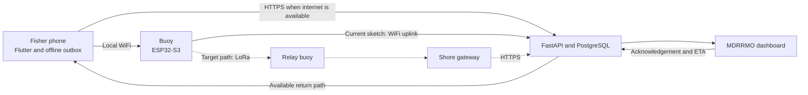

<p align="center"></p>

# AqOne

AqOne is an offline maritime safety system for municipal fishers in New Washington, Aklan.
A phone hands an SOS to a nearby buoy over local WiFi, and the intended LoRa network carries it toward an internet-connected gateway and an MDRRMO dashboard.

Built by **Team Aquanons** for AI Fest 2026.

## Current status

**Current competition focus:** Phase 1, the manual SOS and responder handshake.

**Last status check:** September 10, 2026.

The documented Railway deployment currently returns `404 Application not found` from `/healthz`.
There is no working public demo URL until the backend is redeployed and checked again.
Obtain current evaluator access from Team Aquanons rather than relying on credentials stored in the repository.

| Area | Status | Evidence and limitation |
|---|---|---|
| Mobile pitch build | 🟡 Built and automatically tested | The September 5 build recorded `flutter analyze` with no issues and 184 passing tests. Physical handset installation and the hardware demonstration remain unverified. |
| Backend and dashboard software | 🟡 Built and locally tested | The hosted Railway service is unavailable. Current deployment behavior cannot be demonstrated. |
| Phone to buoy WiFi | 🟡 Implemented in source | The current buoy address is `192.168.4.1`. The complete path has not been reverified on a physical handset and buoy. |
| Buoy firmware | 🟡 WiFi gateway sketch exists | The checked-in sketch accepts SOS messages, queues them, and uses its own WiFi uplink. It does not implement the LoRa relay path. |
| Multi-hop LoRa mesh | ❌ Not implemented | The frame contract exists, but relay firmware and outdoor range evidence do not. |
| Responder acknowledgement and ETA | 🟡 Software paths exist | The current firmware polls the backend without the vessel-device authorization now required by the backend. The checked-in versions need reconciliation before this return path can be claimed. |
| AI safety features | 🟡 Prototype software exists | Most operational evaluations use synthetic data. Field validation and deployment remain incomplete. |
| Catch activity features | 🟡 Foundation exists | Offline logging and coarse aggregation exist. The intended BFAR workflow has not been validated. |

The dated evidence ledger is [`docs/08_DEMO_AND_STATUS.md`](docs/08_DEMO_AND_STATUS.md).
Read its newest dated entry first; older entries record earlier repository states and may no longer describe current behavior.

## Delivery priorities

| Phase | Goal | Acceptance evidence |
|---|---|---|
| **1 - Manual SOS handshake** | Fisher sends SOS, MDRRMO receives it, acknowledges it, and the handset recovers the acknowledgement over a verified return path. | Repeat the complete path on real devices, record the transport used, reload the dashboard, restart the handset, and measure range. |
| **2 - AI safety support** | Add weather risk, squall detection, overdue-trip review, and drift-based search support without making SOS delivery depend on a model. | Validate missed events, false alarms, lead time, data age, and environmental coverage using appropriate evidence. |
| **3 - Fisheries information** | Develop consented catch activity into coarse information for BFAR planning. | Agree on the BFAR use case and validate privacy, aggregation, and decision value. |

The detailed product scope is [`docs/Aqone_PRD (2).md`](docs/Aqone_PRD%20(2).md).
Features marked as roadmap items in the PRD are not current capabilities.
Scope amendments and exclusions are recorded in [`docs/07_SCOPE_OUT.md`](docs/07_SCOPE_OUT.md), although some older authorization wording there still requires reconciliation with current backend behavior.

## How the system works



Solid arrows represent software paths present in the repository.
Dashed arrows represent the intended LoRa path, which has not been implemented or range-tested.

The handset uses four delivery states shared across the product:

```text
saved -> relayed -> delivered -> acknowledged
```

Their meanings are defined in [`docs/06_DELIVERY_STATES.md`](docs/06_DELIVERY_STATES.md).
The app must never display a later state without observing evidence for it.

## Start here

| If you need to... | Read... |
|---|---|
| Understand current priorities and limitations | This README |
| Inspect dated verification evidence | [`docs/08_DEMO_AND_STATUS.md`](docs/08_DEMO_AND_STATUS.md) |
| Understand the target topology | [`docs/01_ARCHITECTURE.md`](docs/01_ARCHITECTURE.md), while treating its old scope exclusions as historical |
| Work on phone to buoy communication | [`docs/03_PHONE_BUOY_WIFI.md`](docs/03_PHONE_BUOY_WIFI.md) and the verified fixtures in [`docs/21_WEEK1_CONTRACT_FIXTURES.md`](docs/21_WEEK1_CONTRACT_FIXTURES.md) |
| Work on LoRa frames | [`docs/02_LOAM_PACKET_SPEC.md`](docs/02_LOAM_PACKET_SPEC.md) |
| Work on backend, dashboard, or mobile APIs | [`docs/05_PUBLIC_API.md`](docs/05_PUBLIC_API.md) |
| Understand the backend layout | [`docs/18_BACKEND_STRUCTURE.md`](docs/18_BACKEND_STRUCTURE.md) |
| Understand the AI features and evidence | [`docs/17_AI_EXPLAINED_SIMPLY.md`](docs/17_AI_EXPLAINED_SIMPLY.md) and [`docs/16_QA_DISCLOSURES.md`](docs/16_QA_DISCLOSURES.md) |
| Work on localization | [`mobile/lib/l10n/README.md`](mobile/lib/l10n/README.md) and [`docs/22_LOCALIZATION_PLAN.md`](docs/22_LOCALIZATION_PLAN.md) |
| Work on visual design | [`docs/47_VISUAL_DESIGN_GUIDE.md`](docs/47_VISUAL_DESIGN_GUIDE.md) |
| Find active and historical project records | [`docs/README.md`](docs/README.md) |

When documents conflict, do not choose a winner by filename or age alone.
Use the PRD for product scope, the relevant contract for an interface, the newest dated verification for observed results, and source plus tests for current implementation evidence.
Record and repair any remaining disagreement before changing a shared interface.

## Local backend

Requirements:

- Python 3.11 or newer
- PostgreSQL 14 or newer
- A disposable development database

The backend reads environment variables from the process.
It does not automatically load `backend/.env`.
Use [`backend/.env.example`](backend/.env.example) as a reference and set at least `DATABASE_URL` before running migrations.
Set `JWT_SECRET` for stable sessions and `ADMIN_SETUP_KEY` if you need to create an operator account.

```bash
cd backend
python -m venv .venv
# Activate .venv using the command for your shell.
python -m pip install -r requirements.txt
python migrate.py
python -m uvicorn app.main:app --reload
```

Check the local service:

```bash
curl http://localhost:8000/healthz
```

Expected response:

```json
{"status":"ok"}
```

Install development tools and run backend checks:

```bash
python -m pip install -r requirements-dev.txt
python -m pytest -q
python -m ruff check .
```

Use a disposable database when `DATABASE_URL` is present during tests because migration tests modify schema and data.
Do not run `python -m app.simulation.generator` against a database containing valuable records; the generator truncates operational tables before loading synthetic data.

`VESSEL_DEVICE_JWT_EXPIRY_HOURS` controls the vessel-device credential lifetime and defaults to 24 hours.

## Mobile checks

The Android platform files are already tracked.
The current source accepts the buoy HTTP endpoint `http://192.168.4.1` and requires an absolute HTTPS backend URL.
The default backend URL currently points to the unavailable Railway service, so a real run must override `BACKEND_BASE_URL` with a reachable HTTPS deployment.

```bash
cd mobile
flutter pub get
flutter analyze
flutter test
```

Build the focused Phase 1 pitch version only after those checks pass:

```bash
flutter build apk --release \
  --dart-define=PITCH_MODE=true \
  --dart-define=BACKEND_BASE_URL=https://your-verified-backend.example
```

The bundled [`mobile/AqOne.apk`](mobile/AqOne.apk) predates the September 5 pitch build.
Do not present it as the current verified source build.

## Buoy firmware

The current sketch is [`firmware/buoy/AqOneBuoy/AqOneBuoy.ino`](firmware/buoy/AqOneBuoy/AqOneBuoy.ino).
Board setup, required libraries, HTTP routes, and hardware limitations are described in [`firmware/buoy/README.md`](firmware/buoy/README.md).

Before flashing:

- Replace local uplink credentials with values supplied outside version control.
- Point the firmware at a verified backend.
- Treat the documented acknowledgement and ETA return as unverified until firmware authorization matches the backend contract.
- Do not claim LoRa delivery; this sketch currently uses WiFi for its backend uplink.

## AI and data

| Function | Current method | Evidence status |
|---|---|---|
| Marine hazard | Gradient-boosted decision trees | Trained on historical weather, cyclone, marine, and bathymetry data; local incident validation is still required. |
| Squall nowcasting | Logistic regression on pressure-array features | Synthetic calibration; live alarms remain gated on field validation. |
| Trip anomaly | Per-vessel statistical profiling | Synthetic evaluation; the previously reported false-alarm result was retracted. |
| Drift and search re-tasking | Monte Carlo drift simulation and Bayesian update | Physics-informed synthetic evaluation; real environmental inputs and responder acceptance remain incomplete. |

No foundation model or external LLM inference API runs inside the product.
AI coding assistants were used during development.
Dataset sources, licences, limitations, and measured results are documented in [`docs/16_QA_DISCLOSURES.md`](docs/16_QA_DISCLOSURES.md) and [`web/ml/model-card.json`](web/ml/model-card.json).

## Safety and limitations

- AqOne does not guarantee message delivery, rescue, prediction accuracy, or survival.
- The manual SOS path must work independently of every model.
- Drift output is a probability distribution, not a location guarantee.
- Automated alerts can miss events and create false alarms; responders retain authority.
- RF allocation, transmit power, duty cycle, device certification, and institutional authority require confirmation before deployment.
- Fisher location and catch data require explicit purpose, access, retention, and privacy controls.
- Tagalog and Aklanon translations remain unreviewed drafts.

## Repository layout

```text
backend/       FastAPI, PostgreSQL migrations, AI services, and tests
firmware/buoy/ ESP32-S3 buoy firmware
gateway/       Gateway work area
mobile/        Flutter handset application
web/           MDRRMO dashboard and browser hazard model
docs/          Contracts, references, decisions, plans, and verification records
fixtures/      Shared contract fixtures
```

## Team

| Member | Responsibility |
|---|---|
| Lenard | Backend, architecture, and deployment |
| Arnold | Ingest pipeline and gateway |
| Daniel | Hardware and buoy firmware |
| Jade | Dashboard |
| Doreen Kay | Mobile UI/UX and pitch |

Contributors should read [`AGENTS.md`](AGENTS.md) and the documentation register in [`docs/README.md`](docs/README.md) before changing shared contracts.

## License

Copyright 2026 Team Aquanons.
This repository is currently proprietary; see [`LICENSE`](LICENSE) for the complete terms.
