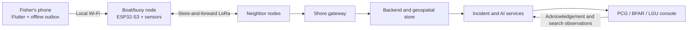

# AqOne

**An offline maritime safety network and AI-assisted search-and-rescue platform for municipal fishers operating beyond cellular coverage.**

Built by **Team Aquanons** for AI Fest 2026.

> **Prototype status:** The current `master` branch implements the Flutter SOS client, its durable offline outbox and delivery-state logic, a static dashboard prototype with sample data, and an experimental ESP32 Wi-Fi chat sketch. The LoRa SOS firmware, gateway, backend, model-training pipelines, and trained AI models are proposed architecture and are not yet implemented. This distinction is intentional and should be preserved during judging.

## Problem Overview and Objectives

Municipal fishers in New Washington, Aklan routinely work in cellular dead zones. Once offshore, a mobile phone may no longer be able to place a call or send an internet-based SOS. If a fisher capsizes, collides, or encounters a sudden squall, responders may learn about the emergency only when the boat fails to return. The delay removes the most useful information: the incident time, last known position, and initial direction of drift.

AqOne aims to:

- provide an SOS path that does not require cellular service;
- preserve and relay distress messages until they reach shore;
- detect emergencies even when the fisher cannot press a button;
- warn fleets about localized, fast-forming squalls;
- turn a last known position into an uncertainty-aware search area;
- give responders timely evidence while keeping the final dispatch decision with humans; and
- build a transparent, auditable safety system that exposes confidence, data age, and coverage gaps.

## Problem Statement and AI-Based Solution

Existing phone-based safety tools fail outside cellular coverage, while manual radios and beacons still depend on a conscious operator. A last known coordinate also becomes stale quickly because a person or disabled vessel continues to move with wind and current.

AqOne addresses the problem in two layers:

1. **Connectivity foundation:** a phone hands an SOS to a nearby node over local Wi-Fi. Boat or buoy nodes store and forward messages over LoRa toward a shore gateway, which relays them to an operations dashboard.
2. **AI-assisted safety layer:** models use sensor, mesh, vessel, weather, and responder evidence before, during, and after an incident.

| Emergency phase | Proposed AI solution | Intended outcome |
|---|---|---|
| **Before** | Spatiotemporal forecasting over barometric observations from moving nodes | Estimate localized squall probability 30–90 minutes ahead and issue targeted **RETURN NOW** warnings |
| **During** | TinyML motion classification, trajectory anomaly detection, heartbeat-loss rules, and confidence fusion | Detect capsize, collision, possible man-overboard, abnormal drift, or silence; request a check-in or raise an explainable alert |
| **After** | OpenDrift/Leeway particle ensembles, validated local-current residual correction, and Bayesian search updating | Produce a probability field and re-rank search sectors as conditions and responder observations change |

The system is decision support, not autonomous incident command. It does not replace the Philippine Coast Guard, official PAGASA warnings, VHF radio, EPIRBs, or responder judgment.

## Proposed End-to-End Architecture



Critical messages are intended to receive unique IDs, integrity protection, replay suppression, priority handling, and durable queues. Model output must retain its source data, transformation version, model or rule version, confidence, and age.

## AI Tools and Frameworks

The following tools are specified in the PRD and technical profile for the AI implementation. They are **planned, not currently integrated into `master`**.

| Function | Model or method | Planned tools/frameworks |
|---|---|---|
| Sensor preprocessing | Calibration, filtering, event windows, quality rules | Embedded C/C++, Python, NumPy |
| Squall nowcasting | Graph neural network or convolutional-recurrent model | PyTorch and geospatial preprocessing |
| Motion detection | Quantized 1D CNN or compact feature/tree classifier | TensorFlow Lite Micro or an equivalent TinyML runtime |
| Trajectory anomaly | Isolation Forest or sequence anomaly baseline with operating-state rules | scikit-learn |
| Incident confidence | Calibrated logistic regression or gradient boosting with safety rules | scikit-learn or XGBoost |
| Drift prediction | Physics-based Leeway particle ensemble | OpenDrift, xarray, NumPy, PostGIS |
| Local-current correction | Residual regression or spatiotemporal interpolation | PyTorch or XGBoost |
| Search allocation | Bayesian posterior and probability-of-detection updates | Python, NumPy, PostGIS |

### Frameworks present in the current prototype

- **Flutter / Dart** for the fisherman-facing mobile application
- **sqflite** for the durable on-device SOS outbox
- **geolocator** for optional GPS capture
- **HTTP** for phone-to-node handoff and future backend reconciliation
- **HTML, CSS, JavaScript, and Leaflet** for the static operations-dashboard prototype
- **ESP32 Arduino libraries** for the experimental Wi-Fi/WebSocket chat sketch

The intended production stack additionally includes FastAPI, PostgreSQL/PostGIS, ESP32-S3 hardware, and SX1262 LoRa radios, but the corresponding backend, gateway, and LoRa firmware are not implemented in this branch.

## Data Sources and Datasets

No trained model, model artifact, or model-ready dataset is committed to this repository. The current dashboard uses clearly identifiable sample data for interface demonstration; it must not be presented as field evidence or training data.

| Data source | Planned use | Current status |
|---|---|---|
| Node GNSS and trip state | Position, trajectory features, incident context, drift validation | Mobile GPS capture is partially implemented; fleet dataset not collected |
| Node IMU event windows | Capsize, impact, and possible man-overboard classification | Planned |
| Node barometer | Offshore pressure field and squall nowcasting | Planned |
| Mesh and gateway metadata | Coverage, route quality, queue health, corroboration | Contracts documented; live dataset not collected |
| Vessel/node registry | Identity, vessel profile, calibration, maintenance, model compatibility | Planned |
| PAGASA warnings and forecasts | Authoritative alerts, weather context, and fallback | Planned; source terms require confirmation |
| Ocean wind/current products, such as HYCOM-compatible forcing | Physical forcing for drift ensembles | Planned; exact production source and license require confirmation |
| Reanalysis and physics-derived synthetic pressure fields | Cold-start nowcasting experiments | Planned |
| Controlled small-craft trials and physically plausible simulation | Motion-model training and hard-negative testing | Planned |
| Search observations and recovery outcomes | Bayesian updates and retrospective drift evaluation | Planned |

Data must be separated by time, geography, vessel, and incident group as appropriate to prevent leakage. Missingness, quality flags, calibration, provenance, and freshness must be retained. Because fishing routes can reveal commercially sensitive livelihood patterns, precise tracks require strict access control, purpose limitation, retention rules, and compliance with the Philippine Data Privacy Act of 2012.

## Current `master` Branch Status

| Capability | Status | Evidence in this repository |
|---|---|---|
| Flutter SOS creation and local persistence | **Implemented** | SQLite outbox, payload model, retry-oriented service structure |
| Honest delivery states | **Implemented and unit-tested** | `saved`, `relayed`, `delivered`, `acknowledged` with non-regressing transitions |
| Phone-to-buoy HTTP client | **Implemented, integration pending** | Configurable buoy URL and documented API contract |
| Operations dashboard interface | **Prototype** | Static web interface using sample/mock records |
| ESP32 Wi-Fi messaging experiment | **Prototype** | Arduino WebSocket chat sketch; not LoRa SOS firmware |
| LoRa SOS relay and multi-hop mesh | **Not implemented in `master`** | Protocol documentation and placeholder folders only |
| Gateway and backend | **Not implemented in `master`** | Placeholder folders and API/design specifications only |
| AI models and data pipelines | **Not implemented in `master`** | PRD and technical design only |
| End-to-end airplane-mode SOS demonstration | **Not yet verified** | Requires working node, LoRa link, gateway, backend, and dashboard integration |

## Repository Structure

```text
arduino/       Experimental ESP32 Wi-Fi/WebSocket sketch
backend/       Backend scaffold; implementation pending
docs/          Architecture, interface contracts, scope, and demo status
firmware/      LoRa buoy firmware scaffold; implementation pending
gateway/       Shore gateway scaffold; implementation pending
mobile/        Flutter application and tests
web/           Static dashboard and public-facing pages
```

Start with [`docs/00_START_HERE.md`](docs/00_START_HERE.md). Interface contracts are defined in [`docs/02_LOAM_PACKET_SPEC.md`](docs/02_LOAM_PACKET_SPEC.md), [`docs/03_PHONE_BUOY_WIFI.md`](docs/03_PHONE_BUOY_WIFI.md), [`docs/04_INGEST_API.md`](docs/04_INGEST_API.md), [`docs/05_PUBLIC_API.md`](docs/05_PUBLIC_API.md), and [`docs/06_DELIVERY_STATES.md`](docs/06_DELIVERY_STATES.md).

## Setup and Run Instructions

### Prerequisites

- Git
- Flutter 3.x with a Dart SDK compatible with `^3.5.0`
- Android Studio or an Android SDK plus an emulator/USB-connected Android device
- Python 3 for serving the static dashboard locally
- Node.js for JavaScript syntax checks
- Internet access for initial Flutter package download and the dashboard's hosted map assets

### 1. Use the required branch

```bash
git clone <repository-url>
cd AIHackathon2026_Aquanons_AqOne
git checkout master
```

If the repository has already been cloned, preserve any local work before pulling or switching branches.

### 2. Run the Flutter application

```bash
cd mobile
flutter pub get
flutter run
```

The default node endpoint is `http://10.0.0.1`. Override endpoints at run time when using a mock node or test backend:

```bash
flutter run \
  --dart-define=BUOY_BASE_URL=http://192.168.1.50:8080 \
  --dart-define=BACKEND_BASE_URL=https://your-backend.example.com
```

The app can demonstrate local SOS creation, persistence, and delivery-state UI without a completed LoRa/backend path. A real handoff requires an endpoint that implements [`docs/03_PHONE_BUOY_WIFI.md`](docs/03_PHONE_BUOY_WIFI.md).

> **Android integration note:** the current tracked manifest does not yet contain the location, Wi-Fi, internet, and node-scoped cleartext configuration documented in [`mobile/README.md`](mobile/README.md). Add that configuration before claiming GPS or physical-node integration on Android.

### 3. Run the dashboard prototype

Open:

- landing page: https://incredible-liberation-production-aad7.up.railway.app/
  Use these credentials:
    - email address: tester@gmail.com
    - pw: 12345678


The dashboard currently presents sample records and is not connected to a live backend.

### 4. Experimental ESP32 sketch

`arduino/MeshChat.ino` is a Wi-Fi/WebSocket messaging experiment for compatible ESP32/Heltec hardware. It is not the proposed LoRa SOS node and is not part of the verified end-to-end workflow. The production node design requires ESP32-S3, SX1262, GNSS, IMU, barometer, protected power, nonvolatile storage, and a guarded SOS button.

## Test Instructions

### Flutter checks

From `mobile/`:

```bash
flutter analyze
flutter test
```

The existing tests cover delivery-state wire values and monotonic transitions, SOS payload serialization and persistence, and key status widgets.

### Web JavaScript syntax

From the repository root in PowerShell:

```powershell
Get-ChildItem web/js/*.js | ForEach-Object { node --check $_.FullName }
```

All five tracked JavaScript files pass `node --check` on the inspected `master` revision.

### Manual evaluator smoke test

1. Launch the Flutter app and complete onboarding.
2. Create an SOS with the device offline or without a reachable node.
3. Confirm the record remains visible as `saved` instead of displaying a false delivery claim.
4. Restart the app and confirm the SOS remains in the local outbox.
5. Run a mock service that follows `docs/03_PHONE_BUOY_WIFI.md`, set `BUOY_BASE_URL` to it, and verify that an accepted handoff advances the state to `relayed`.
6. Serve the dashboard and confirm its sample map, buoy, and incident views load.

An end-to-end SOS should only be marked demonstrated after a phone in airplane mode hands the message to real hardware, the LoRa/gateway/backend path delivers it, the dashboard displays it, and responder acknowledgement persists.

## Safety, Ethics, and Limitations

- AqOne does not guarantee message delivery, rescue, prediction accuracy, or survival.
- Automated alerts can produce false positives or miss unfamiliar events; responder authority is mandatory.
- Drift output is a probability distribution, not a guaranteed coordinate.
- Sparse node density, damaged hardware, RF interference, stale environmental inputs, and unequal deployment can reduce performance.
- Model confidence must fall—or output must be withheld—when data is stale, sparse, uncalibrated, or outside validated conditions.
- RF allocation, transmit power, duty cycle, device certification, environmental-data licenses, privacy roles, and institutional operating authority must be confirmed before deployment.

## Team Aquanons

| Member | Role |
|---|---|
| Lenard | Lead developer, backend, architecture, and deployment |
| Arnold | Full stack and gateway/ingest pipeline |
| Daniel | Hardware and firmware |
| Jade | Dashboard |
| Doreen Kay | UI/UX and pitch |

## Supporting Documents

- [`Aqone PRD`](docs/00_START_HERE.md) — repository-aligned project brief and scope
- [`Architecture`](docs/01_ARCHITECTURE.md)
- [`Demo and current status`](docs/08_DEMO_AND_STATUS.md)
- [`Deliberately scoped-out features`](docs/07_SCOPE_OUT.md)

The expanded AI roadmap in the supplied Product Requirements Document and Technical Profile should be treated as the target system design; the status table above remains the authority for claims about the current prototype.
