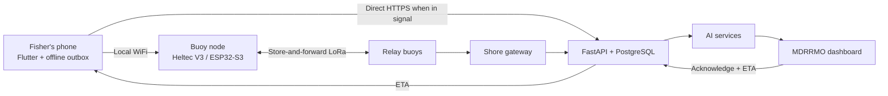

# AqOne

**An offline maritime safety network and AI-assisted search-and-rescue platform for municipal fishers operating beyond cellular coverage.**

Built by **Team Aquanons** for AI Fest 2026.
New Washington, Aklan, Philippines.

---

## Status — what is built, what is not

Read this before any other claim in this file.

| Component | Status |
|---|---|
| **FastAPI + PostgreSQL backend on Railway** | ✅ Deployed, healthcheck green, 73 tests passing |
| **Drift prediction** (Monte Carlo Lagrangian) | ✅ Built, measured, live |
| **Bayesian search re-tasking** | ✅ Built, measured, live |
| **Squall nowcasting** (trained classifier) | ✅ Built, measured, live |
| **Trip anomaly / overdue detection** | ✅ Built, measured, live |
| **Marine hazard model** (trained on real data) | ✅ Built, runs in the browser |
| **SOS pipeline** phone → backend → dashboard | ✅ Working, with de-duplication |
| **Responder loop** acknowledge → ETA → handset | ✅ Working |
| **MDRRMO dashboard** | ✅ Live SOS feed, drift contours, squall watch |
| **Flutter handset app** | ✅ SOS, offline outbox, squall alarm, weather |
| **Buoy firmware** (WiFi AP + SOS gateway) | ✅ Written, **not yet flashed to hardware** |
| **Multi-hop LoRa mesh** | ❌ Frame spec written, relay code not implemented |
| **Outdoor range test** | ❌ Not performed. All range figures are datasheet values |
| **Live roster / headcount** | ❌ Roadmap (PRD §5.6) |
| **Buoy REST endpoint** | ❌ Dashboard buoy markers still hardcoded |

**The end-to-end path that works today:** a phone sends an SOS, it reaches the
deployed backend, appears on the MDRRMO dashboard within 10 seconds, a
dispatcher acknowledges with an ETA, and that ETA appears on the fisher's
handset. **No LoRa hardware is required for this path.**

---

## Problem

Municipal fishers in New Washington, Aklan work in cellular dead zones. Team
field interviews established this is not an edge case — when fishers go out to
fish, **all of them** are beyond signal. If a boat capsizes or a squall builds,
MDRRMO typically learns of it hours later, by word of mouth. The delay destroys
the most useful information: incident time, last known position, and initial
drift direction.

## Solution

Two layers.

**Connectivity.** A phone hands an SOS to a nearby buoy over local WiFi. Buoys
store and forward over LoRa toward a shore gateway, which relays it to the
backend and on to an operations dashboard. The phone never needs cellular
signal.

**AI safety layer.** Four models covering the emergency timeline:

| Phase | Model | What it does |
|---|---|---|
| **Before** | Marine hazard (gradient boosting) | Risk zones per sector from live weather |
| **During** | Squall nowcasting (logistic regression) | Pressure-drop propagation across the array → **RETURN NOW** |
| **Overdue** | Trip anomaly (unsupervised profiling) | Learns each vessel's habits; flags departures from its own pattern |
| **After** | Drift prediction (Monte Carlo Lagrangian) | Probability field and 50/75/95% search contours, re-tasked on negative search results |

AqOne is decision support, not autonomous incident command. It does not replace
the Philippine Coast Guard, PAGASA warnings, VHF radio, EPIRBs, or responder
judgement.

---

## Measured performance

Produced by `backend/app/ai/*_eval.py`. Every figure is tagged
`calibration: "synthetic"` in the API response.

| Metric | Result |
|---|---|
| Drift containment (true position inside 95% contour) | **100%** — n=8 incidents |
| Search area reduction | **1.40×** |
| Drift runtime | 131 ms |
| Current observations used (vs synthetic fallback) | **100%** |
| Overdue detection — median latency | **55 minutes** |
| Overdue detection — false alarm rate | **0%** across 496 normal trips |
| Squall precision / recall | 0.286 / 0.133 |
| Squall mean lead time | **50 minutes** |

**Read these honestly.** Containment of 100% across eight incidents is
encouraging, not proof. Squall recall of 0.133 is weak — the model currently
misses most squalls. Our next step is lowering its decision threshold to trade
precision for recall, because for a life-safety system a missed squall is far
worse than a false alarm.

The marine hazard model is the exception: it is trained on **real** data —
Open-Meteo history (2023-08 → 2025-12), NOAA IBTrACS cyclone tracks and GEBCO
bathymetry — scoring ROC-AUC 0.965, precision 0.829, recall 0.825. Sources,
checksums and limitations in [`web/ml/model-card.json`](web/ml/model-card.json).

---

## Architecture



An SOS is attempted over **both** transports in parallel. The backend
de-duplicates on `(vessel_id, client_ts)` — not a UUID, because a UUID does not
fit in a 64-byte LoRa frame — so the same emergency arriving twice is one
incident on the dispatcher's screen.

---

## Stack

**Backend** — FastAPI, PostgreSQL (PostGIS provisioned), asyncpg, scikit-learn,
NumPy, JWT + bcrypt. Deployed on Railway via Docker.

**Mobile** — Flutter/Dart, sqflite durable outbox, geolocator.

**Dashboard** — HTML/CSS/JS, Leaflet, Chart.js. The hazard model runs in-browser
as exported decision trees; no Python at runtime.

**Firmware** — Heltec WiFi LoRa 32 V3 (ESP32-S3 + SX1262), Arduino.

No foundation models or LLMs are used anywhere in the product.

---

## Data sources

| Source | Use | Licence |
|---|---|---|
| Synthetic generator (`app/simulation/generator.py`) | Calibrating and scoring three models | Self-generated |
| [Open-Meteo](https://open-meteo.com) historical + marine | Hazard model training, live weather | CC-BY 4.0, non-commercial |
| [NOAA IBTrACS v04r01](https://www.ncei.noaa.gov/products/international-best-track-archive) | Cyclone labels | Public domain |
| [GEBCO 2020](https://www.opentopodata.org/datasets/gebco2020/) via OpenTopoData | Bathymetry | Public |
| OpenStreetMap | Basemap tiles | ODbL |

Full declarations, including bias analysis and AI-tool disclosure, are in
[`docs/16_QA_DISCLOSURES.md`](docs/16_QA_DISCLOSURES.md).

---

## Repository structure

```text
backend/     FastAPI + PostgreSQL — API, AI models, migrations, tests
  app/ai/          the four models and their evaluation scripts
  app/api/         HTTP routes
  app/simulation/  synthetic data generator
docs/        Specs, PRD, disclosures
firmware/    Heltec V3 buoy sketch
mobile/      Flutter application
web/         Dashboard, and the in-browser hazard model
```

---

## Setup

### Backend

```bash
cd backend
pip install -r requirements.txt
python migrate.py
uvicorn app.main:app --reload
```

Variables are documented in `backend/.env.example`. `DATABASE_URL`,
`JWT_SECRET` and `ADMIN_SETUP_KEY` must be set in any deployed environment.

### Mobile

```bash
cd mobile
flutter pub get
flutter run
```

Point at a different backend with
`flutter run --dart-define=BACKEND_BASE_URL=https://your-host`.

### Dashboard

Served by the backend at `/`. Run the backend and open `http://localhost:8000`.

### Buoy firmware

Open `firmware/buoy/AqOneBuoy/AqOneBuoy.ino` in Arduino IDE. Board: **Heltec
WiFi LoRa 32(V3)**. Libraries: `ArduinoJson` (v7+), `WebSockets`. Set
`UPLINK_SSID` / `UPLINK_PASS` before flashing.
See [`firmware/buoy/README.md`](firmware/buoy/README.md).

---

## Tests

```bash
cd backend && pytest          # 73 tests
cd mobile  && flutter analyze && flutter test
```

Re-run the model evaluations (writes `backend/app/ai/models/eval_results.json`):

```bash
cd backend
python -m app.ai.drift_eval
python -m app.ai.squall_eval
python -m app.ai.trip_profile_eval
```

Verify the deployed SOS path with no hardware at all:

```bash
curl -X POST https://incredible-liberation-production-aad7.up.railway.app/api/sos \
  -H "Content-Type: application/json" \
  -d '{"vessel_id":"TEST-01","client_ts":1754300000,"boat":"Test Banca",
       "lat":11.6839,"lon":122.4471,"source":"buoy","buoy_id":"BUOY01","seq":1}'
```

It should appear on the dashboard within 10 seconds. Send it twice with the same
`client_ts` — you should still see one incident. That is the de-duplication
working.

---

## Safety, ethics and limitations

- AqOne does not guarantee message delivery, rescue, prediction accuracy or survival.
- Three of the four models are calibrated on **synthetic** data. No dataset of Filipino fishermen's trips at sea exists; collecting one is the purpose of the proposed pilot.
- The hazard model learned **when weather is bad**, not where people die. Its labels are environmental proxies, not verified incidents.
- Drift output is a probability distribution, not a coordinate.
- Coverage is densest near shore and thinnest far out — the opposite of where risk is highest.
- The app's wind indicator is a single 30 km/h threshold shown with its source. It is **not a model** and must never be presented as one.
- "Safe to Go Out" on the dashboard is a **human MDRRMO declaration**, stored with the operator's name — not model output.
- Automated alerts produce false positives and miss unfamiliar events. Responder authority is mandatory.
- We do not and will not sell fisher location data. A safety network that becomes a surveillance network loses the people it protects.
- RF allocation, transmit power, duty cycle, device certification and institutional operating authority must be confirmed before any real deployment.

---

## Team Aquanons

| Member | Role |
|---|---|
| Lenard | Lead developer — backend, architecture, deployment |
| Arnold | Full stack — ingest pipeline, gateway |
| Daniel | Hardware and firmware |
| Jade | Dashboard |
| Doreen Kay | UI/UX and pitch |

Members of the team are from New Washington. The product was built around field
interviews with local fishers, not desk research alone.

---

## Documentation

| Document | Contents |
|---|---|
| [`Aqone_PRD (2).md`](docs/) | **Canonical scope.** Unbuilt sections tagged `[Roadmap — not implemented]` |
| [`00_START_HERE.md`](docs/00_START_HERE.md) | Project brief |
| [`16_QA_DISCLOSURES.md`](docs/16_QA_DISCLOSURES.md) | Datasets, AI tools, hardware, bias analysis |
| [`17_AI_EXPLAINED_SIMPLY.md`](docs/17_AI_EXPLAINED_SIMPLY.md) | Plain-language guide to the four models |
| [`18_BACKEND_STRUCTURE.md`](docs/18_BACKEND_STRUCTURE.md) | Backend folder map |
| [`19_HELTEC_DATA_FLOW.md`](docs/19_HELTEC_DATA_FLOW.md) | Firmware → backend contract |
| [`07_SCOPE_OUT.md`](docs/07_SCOPE_OUT.md) | Deliberate exclusions, and what has since been amended in |
| [`02_LOAM_PACKET_SPEC.md`](docs/02_LOAM_PACKET_SPEC.md) | LoRa frame format |

`Aqone_PRD (2).md` is the scope of record. Where any other document disagrees
with it, the PRD wins.

> **Note:** `docs/04_INGEST_API.md` describes a `POST /api/v1/ingest` endpoint
> that was never built. The real ingest route is `POST /api/sos` — see
> [`19_HELTEC_DATA_FLOW.md`](docs/19_HELTEC_DATA_FLOW.md).
