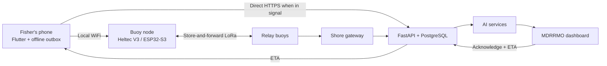

<p align="center"></p>

# AqOne

**An offline maritime safety network and AI-assisted search-and-rescue platform for municipal fishers operating beyond cellular coverage.**

Built by **Team Aquanons** for AI Fest 2026.
For New Washington, Aklan, Philippines.

**Live deployment:** https://incredible-liberation-production-aad7.up.railway.app/
**Evaluator login:** `tester@gmail.com` / `12345678`

---

## Project Overview and Objectives

Municipal fishers in New Washington, Aklan work in cellular dead zones. Field
interviews conducted by the team established that this is not an edge case —
when fishers go out to fish, **all of them** are beyond signal. If a boat
capsizes or a squall builds, MDRRMO typically learns of it hours later, by word
of mouth. That delay destroys the most useful information available: incident
time, last known position, and initial drift direction.

AqOne aims to:

- provide an SOS path that does not require cellular service;
- preserve and relay distress messages until they reach shore;
- detect emergencies even when the fisher cannot press a button;
- warn fleets about localized, fast-forming squalls;
- turn a last known position into an uncertainty-aware search area;
- close the loop by returning a responder's ETA to the fisher; and
- keep every claim auditable — exposing confidence, data age, and coverage gaps.

### Status — what is built, what is not

This table precedes every other claim in this document.

| Component | Status |
|---|---|
| **FastAPI + PostgreSQL backend on Railway** | ✅ Deployed, healthcheck green, 89 tests passing (1 expected failure) |
| **Drift prediction** (Monte Carlo Lagrangian) | ✅ Built, measured, live |
| **Bayesian search re-tasking** | ✅ Built, measured, live |
| **Squall nowcasting** (trained classifier) | ✅ Built, measured, live |
| **Trip anomaly / overdue detection** | ✅ Built, measured, live |
| **Marine hazard model** (trained on real data) | ✅ Built, runs in the browser |
| **SOS pipeline** phone → backend → dashboard | ✅ Working, with de-duplication |
| **Responder loop** acknowledge → ETA → handset | ✅ Working |
| **MDRRMO dashboard** | ✅ Live SOS feed, drift contours, squall watch |
| **Flutter handset app** | ✅ SOS, offline outbox, squall alarm, weather, and vessel-device authorization for routine data |
| **Voluntary catch logging** | ✅ Offline queue with authenticated upload when the phone regains internet |
| **Modelled fish-hotspot guidance** | ❌ Contract agreed; server-side model and public endpoint are not yet implemented |
| **Buoy firmware** (WiFi AP + SOS gateway) | ✅ Written and flashed |
| **Multi-hop LoRa mesh** | ❌ Frame spec written, relay code not implemented |
| **Outdoor range test** | ❌ Not performed. All range figures are datasheet values |
| **Live roster / headcount** | ❌ Roadmap (PRD §5.6) |
| **Buoy REST endpoint** | ❌ Dashboard buoy markers still hardcoded |

**The end-to-end path that works today:** a phone joins the buoy's WiFi, sends
an SOS, it reaches the deployed backend, appears on the MDRRMO dashboard within
10 seconds, a dispatcher acknowledges with an ETA, and that ETA appears on the
fisher's handset. **No LoRa hardware is required for this path.**

### Vessel-device authorization for routine data

Emergency SOS delivery remains available offline and without an account or
cloud credential. For routine per-vessel actions, the backend now issues a
short-lived, revocable credential after an MDRRMO/LGU operator creates a
one-time pairing code. That credential is bound to one vessel and authorizes
the handset's SOS-status reads, responder replies, and catch-log operations;
the backend, rather than a client-supplied vessel ID, decides ownership. The
current mobile implementation holds this credential only while the app runs;
encrypted persistent credential storage and a pairing screen are not yet
implemented. See [`docs/05_PUBLIC_API.md`](docs/05_PUBLIC_API.md) for the API
contract and [`docs/25_MOBILE_SECURITY_IMPLEMENTATION_PLAN.md`](docs/25_MOBILE_SECURITY_IMPLEMENTATION_PLAN.md)
for verified implementation status.

### Fisheries intelligence — separate and opt-in

AqOne also has an optional fisheries-intelligence track. Fishers may choose to
record catch logs, which are stored locally first and uploaded only when the
phone has internet; they never use LoRa airtime reserved for emergencies.
Modelled fish-hotspot guidance is planned to combine consented, aggregated
catch logs with seasonal and environmental indicators. It must show confidence,
coverage, and data age, must not expose an individual fisher's productive
location, and can never override a safety warning. It is **not implemented
yet**: the app deliberately shows no hotspot layer until the server-side model
and endpoint exist. See [`docs/23_INTEGRATED_SYSTEM_DESIGN.md`](docs/23_INTEGRATED_SYSTEM_DESIGN.md)
for the proposed subsystem and [`docs/05_PUBLIC_API.md`](docs/05_PUBLIC_API.md)
for its current API status.

### Week 1 dashboard/Flutter contract sprint (in progress)

Tracked in full, phase by phase with exact commands and results, in
[`docs/20_WEEK_1_DASHBOARD_FLUTTER_IMPLEMENTATION_PLAN.md`](docs/20_WEEK_1_DASHBOARD_FLUTTER_IMPLEMENTATION_PLAN.md).
What that sprint changed, and what is and isn't independently verified so far:

- **Buoy Wi-Fi/JSON contract.** The Flutter app was pointed at the wrong buoy
  IP (`10.0.0.1` instead of the firmware's actual `192.168.4.1`) and parsing
  fields the firmware doesn't send (`batt`, `mesh`, integer `buoy_id`) instead
  of the ones it does (`uplink`, `queue_depth`, string `buoy_id`). Fixed, and
  an offline handset now falls back to polling the buoy for a responder's ETA
  when the backend is unreachable, instead of giving up. **Not verified by
  `flutter analyze`/`flutter test`** — no Flutter SDK was available in the
  environment these changes were made in. Manually reviewed only; treat as
  unverified until run for real.
- **Dashboard honesty and XSS fixes.** The header's "LIVE" badge and the
  "Last updated" banner text were previously fake (static markup / an
  independent counter unrelated to whether a refresh had actually succeeded).
  Both now reflect the real time since `/api/sos/active` last succeeded, with
  visible STALE/OFFLINE states. Fixed real unescaped-HTML injection points
  where a fisher's SOS note/boat name reached the dashboard's `innerHTML` and
  a Leaflet tooltip unescaped. **Verified** — `node --check web/js/dashboard.js`
  and `node --test web/test/dashboard-utils.test.js` (21 cases) both ran and
  passed in the same environment.
- **Backend input validation and one real auth gap.** `POST /api/sos` now
  rejects oversized `vessel_id`/`boat`/`note` (mirroring the handset's own
  caps) instead of accepting arbitrary-length text on an unauthenticated
  route. `POST /api/advisories/alert` had no auth dependency at all despite
  publishing directly to the public advisory feed and no caller for it exists
  anywhere in this repo; it now requires a token like every other write in
  that router. **Verified after the sprint** — the backend suite now passes
  with 89 tests passing and one expected failure; `ruff check .` also passes.
- **APK.** Not rebuilt this sprint — no Android/Flutter build toolchain was
  available. `mobile/AqOne.apk` below is still the pre-sprint build.

---

## Problem Statement and AI-Based Solution

Existing phone-based safety tools fail outside cellular coverage, while radios
and beacons still depend on a conscious operator. A last known coordinate also
goes stale quickly, because a person or disabled vessel keeps moving with wind
and current.

AqOne addresses this in two layers.

**1. Connectivity foundation.** A phone hands an SOS to a nearby buoy over local
WiFi. Buoys store and forward over LoRa toward a shore gateway, which relays to
the backend and on to an operations dashboard. The phone never needs cellular
signal.

**2. AI safety layer.** Four models covering the emergency timeline:

| Phase | Model | Method | What it does |
|---|---|---|---|
| **Before** | Marine hazard | Gradient boosting classifier | Risk zones per sector from live weather |
| **During** | Squall nowcasting | Logistic regression on pressure-propagation features | Detects a squall crossing the buoy array → **RETURN NOW** |
| **Overdue** | Trip anomaly | Unsupervised per-vessel statistical profiling | Learns each vessel's habits; flags departures from its *own* pattern, not a fixed timer |
| **After** | Drift prediction | Monte Carlo Lagrangian particle ensemble | Probability field and 50/75/95% search contours, re-tasked on negative search results |

Drift prediction is **physics, not machine learning** — a Lagrangian simulation
using published leeway coefficients, the same family of model real SAR services
use. Trip anomaly uses no ML library at all; it is statistical profiling in
NumPy.

AqOne is decision support, not autonomous incident command. It does not replace
the Philippine Coast Guard, PAGASA warnings, VHF radio, EPIRBs, or responder
judgement.

### Measured performance

Produced by `backend/app/ai/*_eval.py`. Every figure is tagged
`calibration: "synthetic"` in the API response.

| Metric | Result |
|---|---|
| Drift containment (true position inside 95% contour) | **100%** — n=8 incidents |
| Search area reduction | **1.40×** |
| Drift runtime | 131 ms |
| Current observations used (vs synthetic fallback) | **100%** |
| Overdue detection — median latency | **55 minutes** |
| Overdue detection — false alarm rate | **0%** across 496 normal trips |
| Squall precision / recall | 0.286 / 0.133 |
| Squall mean lead time | **50 minutes** |

**These figures should be read conservatively.** Containment of 100% across
eight incidents is encouraging, not proof. Squall recall of 0.133 is weak — the
model currently misses most squalls. The team's next step is lowering its
decision threshold to trade precision for recall, on the reasoning that for a
life-safety system a missed squall is far worse than a false alarm.

The marine hazard model is the exception: it is trained on **real** data,
scoring ROC-AUC 0.965, precision 0.829, recall 0.825. Sources, checksums and
limitations are recorded in [`web/ml/model-card.json`](web/ml/model-card.json).

### Architecture



An SOS is attempted over **both** transports in parallel. The backend
de-duplicates on `(vessel_id, client_ts)` — not a UUID, because a UUID does not
fit in a 64-byte LoRa frame — so the same emergency arriving twice becomes one
incident on the dispatcher's screen.

---

## AI Tools, Frameworks, and Datasets Used

### Models and methods

| Function | Method | Library | Trained on |
|---|---|---|---|
| Marine hazard / danger zone | `GradientBoostingClassifier` | scikit-learn 1.9.0 | **Real** weather + cyclone + bathymetry |
| Squall nowcasting | `Pipeline(StandardScaler, LogisticRegression)`, `GroupShuffleSplit` | scikit-learn 1.9.0 | Synthetic |
| Trip anomaly / overdue | Unsupervised statistical profiling (mean, std, p10/p90 per vessel) | NumPy only | Synthetic |
| Drift prediction | Monte Carlo Lagrangian particle ensemble (leeway + current + diffusion) | NumPy | Synthetic; physics-informed |
| Bayesian search re-tasking | Posterior update with detection probability | NumPy | — |

**No foundation models or LLMs are used anywhere in the product.** There are no
pretrained weights, no external inference APIs, and no PyTorch, TensorFlow or
XGBoost.

AI coding assistants were used during development. The architecture, model
choices, honesty constraints and scope decisions were made by the team.

### Frameworks

| Layer | Stack |
|---|---|
| **Backend** | FastAPI 0.139, PostgreSQL (PostGIS provisioned), asyncpg, Pydantic, JWT + bcrypt, Docker on Railway |
| **AI** | scikit-learn 1.9.0, NumPy 2.4, pandas 3.0, joblib |
| **Mobile** | Flutter / Dart, sqflite durable outbox, geolocator, http |
| **Dashboard** | HTML / CSS / JavaScript, Leaflet, Chart.js. The hazard model runs **in-browser** as exported decision trees — no Python at runtime |
| **Firmware** | Heltec WiFi LoRa 32 V3 (ESP32-S3 + SX1262), Arduino, ArduinoJson, WebSockets |

### Datasets

| Source | Use | Licence |
|---|---|---|
| Synthetic generator (`app/simulation/generator.py`) | Calibrating and scoring three models — buoy array, barometric series, current field, 14 days of vessel trips | Self-generated |
| [Open-Meteo Historical Weather API](https://open-meteo.com/en/docs/historical-weather-api) | Hazard model training, 2023-08-01 → 2025-12-31, 12,456 train / 8,760 test rows | CC-BY 4.0, non-commercial |
| [Open-Meteo Marine API](https://open-meteo.com/en/docs/marine-weather-api) (ERA5-Ocean) | Wave height and period features | CC-BY 4.0 |
| [NOAA IBTrACS v04r01](https://www.ncei.noaa.gov/products/international-best-track-archive) | Tropical cyclone labels (189 of 1,114 positives) | Public domain |
| [GEBCO 2020](https://www.opentopodata.org/datasets/gebco2020/) via OpenTopoData | Seabed depth per sector | Public |
| [Open-Meteo Forecast API](https://open-meteo.com) | Live conditions in the app and dashboard | CC-BY 4.0 |
| OpenStreetMap | Basemap tiles | ODbL |

Every synthetic row is flagged `is_synthetic = TRUE` in the database, and all
evaluation scripts filter on that column — simulated and real data cannot
silently mix.

Full declarations, including bias analysis and hardware disclosure, are in
[`docs/16_QA_DISCLOSURES.md`](docs/16_QA_DISCLOSURES.md).

---

## Setup and Run Instructions for Testing

### Fastest test — no setup, no hardware

The system is deployed and can be evaluated without installing anything.

**Dashboard:** https://incredible-liberation-production-aad7.up.railway.app/

**Evaluator login**

| Field | Value |
|---|---|
| Email | `tester@gmail.com` |
| Password | `12345678` |

This is a demo account provided for judging on a private repository. It will be
removed after evaluation.

Confirm the backend is live:

```bash
curl https://incredible-liberation-production-aad7.up.railway.app/healthz
```

Send a test SOS and watch it appear on the dashboard map within 10 seconds:

```bash
curl -X POST https://incredible-liberation-production-aad7.up.railway.app/api/sos \
  -H "Content-Type: application/json" \
  -d '{"vessel_id":"TEST-01","client_ts":1754300000,"boat":"Test Banca",
       "lat":11.6839,"lon":122.4471,"source":"buoy","buoy_id":"BUOY01","seq":1}'
```

Sending it **twice with the same `client_ts`** should still produce one
incident. That is the de-duplication working.

### Install the Android app — no build required

A pre-built APK is included at **`mobile/AqOne.apk`** (58 MB) for evaluators who
would rather not install the Flutter toolchain.

1. Copy `mobile/AqOne.apk` to an Android device.
2. Open it. Android will ask permission to install from an unknown source —
   allow it for the app doing the installing (Files or Chrome).
3. Launch AqOne and complete onboarding.

The build points at the live Railway deployment by default, so an SOS sent from
the app appears on the dashboard above without any further configuration.

Android only. iOS requires a signed build and is not provided.

### Prerequisites for local builds

Python 3.11+, Flutter 3.5+, PostgreSQL 14+ (PostGIS optional), Arduino IDE for
firmware.

### 1. Backend

```bash
cd backend
pip install -r requirements.txt
python migrate.py
uvicorn app.main:app --reload
```

Variables are documented in `backend/.env.example`. `DATABASE_URL`,
`JWT_SECRET` and `ADMIN_SETUP_KEY` must be set in any deployed environment.
`VESSEL_DEVICE_TOKEN_TTL_HOURS` optionally changes the vessel-device token
lifetime (24 hours by default). The existing migration step also applies the
vessel-device pairing and revocation tables.

Generate the synthetic dataset, which the evaluation scripts require:

```bash
python -m app.simulation.generator --days 14 --seed 42
```

### 2. Dashboard

Served by the backend at `/`. Start the backend and open
`http://localhost:8000`. Operator accounts are created through the admin signup
page, gated by `ADMIN_SETUP_KEY`.

### 3. Mobile app

To install without building, use the pre-built `mobile/AqOne.apk` described
above. To build from source:

```bash
cd mobile
flutter pub get
flutter run
```

To produce a fresh APK:

```bash
flutter build apk --release
# output: build/app/outputs/flutter-apk/app-release.apk
```

To point the app at a different backend:

```bash
flutter run --dart-define=BACKEND_BASE_URL=https://your-host
```

For routine per-vessel testing, have an MDRRMO/LGU operator create a one-time
pairing code, then enroll the handset against that backend. Exact request and
revocation rules are in [`docs/05_PUBLIC_API.md`](docs/05_PUBLIC_API.md).
Pairing is not required to raise or queue an SOS.

### 4. Buoy firmware

Open `firmware/buoy/AqOneBuoy/AqOneBuoy.ino` in Arduino IDE.

- **Board:** Heltec WiFi LoRa 32(V3)
- **Libraries:** `ArduinoJson` (v7+), `WebSockets` (Markus Sattler)
- Set `UPLINK_SSID` / `UPLINK_PASS` before flashing

On boot, Serial at 115200 shows:

```
[wifi] uplink ok  ip=192.168.x.x  ch=6
[wifi] OPEN AP 'Aquan' up on 192.168.4.1 ch=6 max=10
[boot] ready. 0 SOS recovered from flash
```

Joining the open `Aquan` network allows an SOS to be posted directly:

```bash
curl -X POST http://192.168.4.1/v1/sos \
  -H "Content-Type: application/json" \
  -d '{"vessel_id":"BANCA-7","client_ts":1754300500,"boat":"Maria Gracia",
       "lat":11.6839,"lon":122.4471,"note":"engine dead"}'
```

**Note:** this sketch is WiFi-only. It does not drive the SX1262 LoRa radio —
see the status table above and [`firmware/buoy/README.md`](firmware/buoy/README.md).

### 5. Run the tests

```bash
cd backend && pytest          # 89 passed, 1 expected failure
cd backend && ruff check .
cd mobile  && flutter analyze && flutter test
```

### 6. Reproduce the measured AI results

Run from `backend/`, with `DATABASE_URL` pointing at a database containing the
synthetic dataset. These write `backend/app/ai/models/eval_results.json`, which
`/api/ai/metrics` serves to the dashboard's SAR tab:

```bash
python -m app.ai.drift_eval
python -m app.ai.squall_eval
python -m app.ai.trip_profile_eval
```

All three should be run against the same dataset. If the SAR tab shows an empty
state, that file has not been generated — the dashboard deliberately shows
nothing rather than placeholder numbers.

### 7. Manual end-to-end check

1. Launch the app and complete onboarding.
2. Send an SOS with the device offline — it should remain `saved` rather than claiming false delivery.
3. Restart the app — the SOS should still be in the outbox.
4. Restore connectivity — it should advance to `relayed` and appear on the dashboard.
5. Acknowledge it on the dashboard with an ETA — a countdown should appear on the handset.
6. Power-cycle the buoy mid-delivery — the queued SOS should still arrive, demonstrating that store-and-forward survives a brown-out.

---

## Safety, Ethics and Limitations

- AqOne does not guarantee message delivery, rescue, prediction accuracy or survival.
- Three of the four models are calibrated on **synthetic** data. No dataset of Filipino fishermen's trips at sea exists; collecting one is the purpose of the proposed pilot.
- The hazard model learned **when weather is bad**, not where people die. Its labels are environmental proxies, not verified incidents.
- Drift output is a probability distribution, not a coordinate.
- Coverage is densest near shore and thinnest far out — the opposite of where risk is highest.
- The app's wind indicator is a single 30 km/h threshold shown with its source. It is **not a model** and must never be presented as one.
- "Safe to Go Out" on the dashboard is a **human MDRRMO declaration**, stored with the operator's name — not model output.
- Automated alerts produce false positives and miss unfamiliar events. Responder authority is mandatory.
- Team Aquanons does not and will not sell fisher location data. A safety network that becomes a surveillance network loses the people it protects.
- RF allocation, transmit power, duty cycle, device certification and institutional operating authority must be confirmed before any real deployment.

---

## Repository Structure

```text
backend/     FastAPI + PostgreSQL — API, AI models, migrations, tests
  app/ai/          the four models and their evaluation scripts
  app/api/         HTTP routes
  app/simulation/  synthetic data generator
docs/        Specs, PRD, disclosures
firmware/    Heltec V3 buoy sketch
mobile/      Flutter application
  AqOne.apk        pre-built Android release, ready to install
web/         Dashboard, and the in-browser hazard model
```

---

## Team Aquanons

| Member | Role |
|---|---|
| Lenard | Lead developer — backend, architecture, deployment |
| Arnold | Full stack — ingest pipeline, gateway |
| Daniel | Hardware and firmware |
| Jade | Dashboard |
| Doreen Kay | UI/UX and pitch |

Members of the team are from New Washington. The product was built around field
interviews with local fishers, not desk research alone.

---

## Supporting Documents

| Document | Contents |
|---|---|
| `docs/Aqone_PRD (2).md` | **Canonical scope.** Unbuilt sections tagged `[Roadmap — not implemented]` |
| [`00_START_HERE.md`](docs/00_START_HERE.md) | Project brief |
| [`16_QA_DISCLOSURES.md`](docs/16_QA_DISCLOSURES.md) | Datasets, AI tools, hardware, bias analysis |
| [`17_AI_EXPLAINED_SIMPLY.md`](docs/17_AI_EXPLAINED_SIMPLY.md) | Plain-language guide to the four models |
| [`18_BACKEND_STRUCTURE.md`](docs/18_BACKEND_STRUCTURE.md) | Backend folder map |
| [`19_HELTEC_DATA_FLOW.md`](docs/19_HELTEC_DATA_FLOW.md) | Firmware → backend contract |
| [`05_PUBLIC_API.md`](docs/05_PUBLIC_API.md) | Public API and vessel-device pairing contract |
| [`25_MOBILE_SECURITY_IMPLEMENTATION_PLAN.md`](docs/25_MOBILE_SECURITY_IMPLEMENTATION_PLAN.md) | Mobile security controls, evidence, and remaining hard stops |
| [`07_SCOPE_OUT.md`](docs/07_SCOPE_OUT.md) | Deliberate exclusions, and what has since been amended in |
| [`02_LOAM_PACKET_SPEC.md`](docs/02_LOAM_PACKET_SPEC.md) | LoRa frame format |

`Aqone_PRD (2).md` is the scope of record. Where any other document disagrees
with it, the PRD takes precedence.

> **Note:** `docs/04_INGEST_API.md` describes a `POST /api/v1/ingest` endpoint
> that was never built. The real ingest route is `POST /api/sos` — see
> [`19_HELTEC_DATA_FLOW.md`](docs/19_HELTEC_DATA_FLOW.md).
