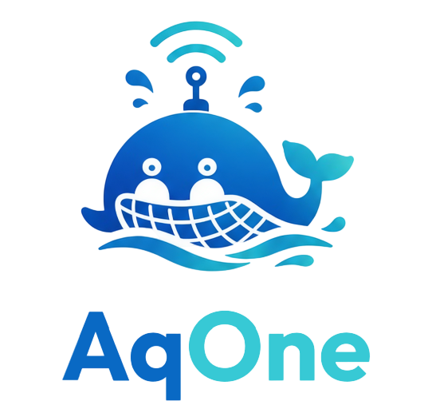
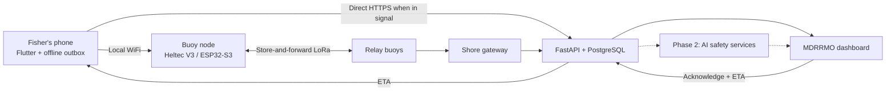

<p align="center"></p>

# AqOne

**An offline maritime safety network focused first on a manual SOS handshake between municipal fishers and MDRRMO, followed by AI safety support and fishing hotspots for BFAR regulation.**

Built by **Team Aquanons** for AI Fest 2026.
For New Washington, Aklan, Philippines.

**Live deployment:** https://aihackathon2026aquanonsaqone-production.up.railway.app/
**Evaluator login:** `tester@gmail.com` / `12345678`

---

## Project Overview and Objectives

Municipal fishers in New Washington, Aklan work in cellular dead zones. Field
interviews conducted by the team established that this is not an edge case —
when fishers go out to fish, **all of them** are beyond signal. If a boat
capsizes or a squall builds, MDRRMO typically learns of it hours later, by word
of mouth. That delay destroys the most useful information available: incident
time, last known position, and initial drift direction.

**Current focus: Phase 1, the manual SOS handshake, for the September 15, 2026 pitching competition.**
The delivery priorities below were revised on September 5, 2026.
Complete and verify each product phase before advancing to the next.

| Product phase | Focus | Delivery objective |
|---|---|---|
| **Phase 1 - Manual SOS handshake (current)** | Fisher sends SOS → buoy/gateway → backend → MDRRMO acknowledges → handset receives acknowledgement and ETA over an available return path. | Prove the handshake on real devices, with an offline outbox, retry/de-duplication, honest delivery states and acknowledgement that persists after reload. Record which transport actually carried the message and its measured range. |
| **Phase 2 - AI safety features** | Marine weather risk and squall detection, trip anomaly / overdue review, and drift-based search support. | Validate a scenario from hazardous conditions and missed expected contacts to responder review and a conditional search estimate. Manual SOS remains independent of every model. |
| **Phase 3 - Fishing hotspots for BFAR regulation** | Develop the catch-activity foundation into fishing-hotspot information supporting BFAR fisheries regulation and planning. | Validate the hotspot information and its intended BFAR use with consented catch data and coarse aggregated outputs. This is future work, outside the Phase 1 competition commitment. |

Across all phases, expose data age, uncertainty and coverage gaps, and keep emergency delivery available without a fisher account.
Existing AI and catch components remain in the repository; their implementation does not make Phases 2 or 3 validated or complete.

### Status — what is built, what is not

This table records implementation and verification history, separately from the product delivery phases above.
AI components belong to Phase 2; catch logging and hotspot components belong to Phase 3.
Numbered phases inside the historical implementation-plan notes below refer to those individual plans, not these three product phases.

| Component | Status |
|---|---|
| **FastAPI + PostgreSQL backend on Railway** | ✅ Live: `/healthz` and `/health/ready` returned 200 on 29 August 2026. The recorded 89-pass/1-expected-failure backend result predates the latest commit and has not been rerun in the current environment. |
| **Drift prediction** (Monte Carlo Lagrangian) | 🟡 The particle model and its synthetic-evaluation numbers (below) are built and measured. `docs/40_DRIFT_PREDICTION_SEARCH_RETASKING_IMPLEMENTATION_PLAN.md` Phases 1-4 (protected case lifecycle, environmental quality gate, immutable run snapshots, map-based search reporting) are built and unit/API-tested but **not yet deployed** - confirmed by a read-only check against the live URL on 30 August 2026 (`docs/08_DEMO_AND_STATUS.md`). With zero buoys in the water, a real case will read `insufficient_environmental_data` even once deployed, by design - not a bug. |
| **Bayesian search re-tasking** | 🟡 Same status as drift prediction above: built and tested, not yet deployed, and gated on the same buoy-current prerequisite. |
| **Squall nowcasting** (trained classifier) | 🟡 The live Railway deployment (verified 29 August 2026) still runs the pre-Phase-3 build described below: its public feed reads synthetic data and can reach a stale RETURN NOW. A local branch (`codex/short-messaging-weather-advisories`, not yet merged to `master`/redeployed) fixes this — production reads live pressure telemetry only, a quality gate rejects missing/stale/insufficient arrays as `unknown`, and RETURN NOW is disabled for live data behind a deployment flag (`SQUALL_RETURN_NOW_ENABLED`, default off) pending a field-validated MDRRMO sign-off. See docs/39_SQUALL_NOWCASTING_IMPLEMENTATION_PLAN.md and the squall entry under "Verification snapshot" below. |
| **Trip anomaly / overdue detection** | 🟡 Live-queue path built and honest (docs/38 Phases 1-3: read-only polling, non-destructive scoring, persistent responder review). The published false-alarm figure below was found to be a measurement artifact and retracted (Phase 4) - not yet re-measured against a live database. |
| **Marine hazard model** (trained on real data) | ✅ Built, runs in the browser |
| **SOS pipeline** phone → backend → dashboard | ✅ Working, with de-duplication |
| **Responder loop** acknowledge → ETA → handset | ✅ Working |
| **MDRRMO dashboard** | ✅ Live SOS feed, drift contours, squall watch |
| **Flutter handset app** | ✅ Clean: `flutter analyze` 0 issues, 184/184 tests pass. Opt-in pitch mode (`PITCH_MODE=true`) focuses the UI on the manual SOS handshake while keeping deferred Phase 2/3 features available in normal builds. Release APK built cleanly (`build/app/outputs/flutter-apk/app-release.apk`). |
| **Voluntary catch logging** | ✅ Offline queue with authenticated upload when the phone regains internet |
| **Catch-activity hotspot guidance** | 🟡 A deployed `catch-density-v1` endpoint aggregates consented logs into coarse cells with a three-reporter minimum. It returned no eligible cells on 29 August 2026 and is not a predictive catch model. |
| **Buoy firmware** (WiFi AP + SOS gateway) | ✅ Written and flashed |
| **Multi-hop LoRa mesh** | ❌ Frame spec written, relay code not implemented |
| **Outdoor range test** | ❌ Not performed. All range figures are datasheet values |
| **Live roster / headcount** | ❌ Roadmap (PRD §5.6) |
| **Buoy REST endpoint** | 🟡 Public buoy records are available; dashboard buoy markers and health data remain hardcoded/demo data. |

**Previously reported integration path:** a phone joins the buoy's WiFi, sends an SOS through its WiFi uplink to the backend, and the SOS appears on the MDRRMO dashboard within 10 seconds; a dispatcher acknowledges with an ETA, which returns to the handset.
**This WiFi route does not prove LoRa delivery or offshore coverage.**
Phase 1 must re-verify the current handset, buoy, backend and dispatcher together, including the return path, before claiming the handshake complete.
The dated records below are historical evidence, not a fresh deployment or hardware check.

#### Verification snapshot — 29 August 2026

- The corrected Railway deployment, dashboard, `/healthz`, `/health/ready`, and
  public buoy, squall, and hotspot feeds all returned HTTP 200.
- Dashboard JavaScript passed syntax checks and the dashboard utility suite
  passed 21/21 tests. Backend Python bytecode compilation also passed; the full
  backend test suite could not be rerun in the available environment.
- The public squall feed returned a synthetic RETURN NOW detection based on
  data from 14 August 2026. It is stale demo/model data, not a current warning.
- After `flutter gen-l10n`, `dart analyze` reports two errors in the chat-page
  constructor call. Do not rebuild or present the bundled APK as reflecting the
  current source until those errors are fixed and Flutter tests pass.

#### Squall nowcasting Phase 5 verification — 29 August 2026

Recorded per `docs/39_SQUALL_NOWCASTING_IMPLEMENTATION_PLAN.md` Phase 5.
Environment: Windows 11, Python 3.11.9, Flutter 3.44.7, Node v24.14.0. A local
PostgreSQL 18 service is running on this machine but its credentials are not
the documented default and were not pursued further at the user's direction;
Docker Desktop's engine did not start. As in every prior phase this session,
this means no live-server/real-database manual acceptance run was possible —
verified instead by the full automated suite (which exercises the same code
against fake pools) plus two things not done in prior phases: direct HTTP
checks against the real Railway deployment, and a real local browser DOM
check of the dashboard's new squall panel.

**Automated checks, all green except the same pre-existing, unrelated
failures already present at this session's baseline:**

- `cd backend && python -m pytest -q` — 200 passed, 1 xfailed;
  `test_demo.py::test_firing_same_beat_is_idempotent` fails (a real,
  pre-existing `NameError`-causing bug in `fire_beat()`, tracked as its own
  task, unrelated to squall work).
- `cd backend && ruff check .` — 8 pre-existing issues, all in
  `calibrate_demo_squall.py` and `app/demo/scenarios.py`; none in any file
  this session touched.
- `cd mobile && flutter analyze` — no issues found.
  `flutter test test/squall_alert_test.dart` — 14/14 passed.
- `cd web && node --test test/dashboard-utils.test.js` — 58/58 passed.

**Direct checks against the live Railway deployment** (unauthenticated GETs
and one deliberately-unauthenticated POST only — no write capability, no
credentials used):

- `GET /healthz` → `200 {"status":"ok"}`.
- `GET /api/public/squall` → `200`, still the **pre-Phase-3 response shape**
  (`as_of`/`stale`/`stale_reason`, `source` as a free-text string) reporting
  a stale synthetic reading from 14 August 2026. Confirms this session's
  live-only/quality-gated/alarm-safe rewrite (Phases 2-3) has **not** reached
  production yet.
- `POST /api/v1/pressure-events` with no `X-Api-Key` → `401`. Confirms
  Phase 1's gateway-only ingest endpoint **is** live and correctly rejects an
  unauthenticated write (the route exists and its auth guard runs before any
  body validation).
- `GET /api/demo/squall` → `404` — expected either way: this route is only
  mounted when `DEMO_MODE` is set, so a 404 here does not by itself confirm
  or rule out whether Phase 3's code has been deployed.
- `git log`: the local branch was 1 commit ahead of
  `origin/codex/short-messaging-weather-advisories` (Phase 4's commit) at the
  start of this phase, and 3 commits ahead of `origin/master` (the Phase 3
  wiring, a line-ending fix, and Phase 4's evaluation work) — consistent
  with the above: Phase 1 reached `master` and Railway; Phases 2-4 have not.

**Local browser check** (a plain static file server over this checkout's
`web/` directory, no backend running, so every fetch legitimately fails):
confirmed the squall panel renders the neutral "Squall status cannot be
confirmed right now" state — never a false "no active detections" — and
that the `RETURN NOW`/header badges read `UNKNOWN`, not `MONITORING`. This
check caught one real bug before it shipped: the client-side fallback for a
totally unreachable backend was being labelled `DEMO` (implying deliberately
synthetic data) rather than reporting an honest unknown source; fixed in
`web/js/dashboard-utils.js`'s `squallStatusHtml()`, covered by a new test in
`web/test/dashboard-utils.test.js`.

**What remains, unchanged from every prior phase:** the code is not proven
against a live handset, buoy, or dispatcher screen. Additionally specific to
squall: production has not been redeployed with Phases 2-4, and RETURN NOW
cannot be enabled for live use in any environment until a named MDRRMO
approver signs off a completed field-validation log
(`docs/08_DEMO_AND_STATUS.md` "Squall field-validation log") — which does
not exist yet and was not fabricated.

### Vessel-device authorization for routine data

Emergency SOS delivery remains available offline and without an account or
cloud credential. For routine per-vessel actions, the backend now issues a
short-lived, revocable credential after an MDRRMO/LGU operator creates a
one-time pairing code. That credential is bound to one vessel and authorizes
the handset's SOS-status reads, responder replies, and catch-log operations;
the backend, rather than a client-supplied vessel ID, decides ownership. The
current mobile implementation holds this credential only while the app runs;
encrypted persistent credential storage and a pairing screen are not yet
implemented. See [`docs/05_PUBLIC_API.md`](docs/05_PUBLIC_API.md) for the API
contract and [`docs/25_MOBILE_SECURITY_IMPLEMENTATION_PLAN.md`](docs/25_MOBILE_SECURITY_IMPLEMENTATION_PLAN.md)
for verified implementation status.

### Fisheries intelligence — separate and opt-in

**Phase 3 roadmap: fishing hotspots supporting BFAR fisheries regulation and planning.**
This work follows the manual SOS handshake and AI safety phases.
The existing catch-log and aggregate-activity components are a foundation, not a completed BFAR regulatory tool or validated predictive hotspot model.
The specific BFAR workflow and validation criteria remain to be defined with BFAR.

Fishers may choose to
record catch logs, which are stored locally first and uploaded only when the
phone has internet; they never use LoRa airtime reserved for emergencies.
Catch-activity hotspot guidance currently aggregates consented logs into coarse
cells, requires at least three independent reporters, and never exposes an
individual fisher's productive location. It is not a predictive catch model,
does not use LoRa airtime, and can never override a safety warning. The public
endpoint is deployed but returned no qualifying cells on 29 August 2026. See
[`docs/23_INTEGRATED_SYSTEM_DESIGN.md`](docs/23_INTEGRATED_SYSTEM_DESIGN.md)
and [`docs/05_PUBLIC_API.md`](docs/05_PUBLIC_API.md) for the subsystem and API
contract.

### Week 1 dashboard/Flutter contract sprint (in progress)

Tracked in full, phase by phase with exact commands and results, in
[`docs/20_WEEK_1_DASHBOARD_FLUTTER_IMPLEMENTATION_PLAN.md`](docs/20_WEEK_1_DASHBOARD_FLUTTER_IMPLEMENTATION_PLAN.md).
What that sprint changed, and what is and isn't independently verified so far:

- **Buoy Wi-Fi/JSON contract.** The Flutter app was pointed at the wrong buoy
  IP (`10.0.0.1` instead of the firmware's actual `192.168.4.1`) and parsing
  fields the firmware doesn't send (`batt`, `mesh`, integer `buoy_id`) instead
  of the ones it does (`uplink`, `queue_depth`, string `buoy_id`). Fixed, and
  an offline handset now falls back to polling the buoy for a responder's ETA
  when the backend is unreachable, instead of giving up. **Not verified by
  `flutter analyze`/`flutter test`** — no Flutter SDK was available in the
  environment these changes were made in. Manually reviewed only; treat as
  unverified until run for real.
- **Dashboard honesty and XSS fixes.** The header's "LIVE" badge and the
  "Last updated" banner text were previously fake (static markup / an
  independent counter unrelated to whether a refresh had actually succeeded).
  Both now reflect the real time since `/api/sos/active` last succeeded, with
  visible STALE/OFFLINE states. Fixed real unescaped-HTML injection points
  where a fisher's SOS note/boat name reached the dashboard's `innerHTML` and
  a Leaflet tooltip unescaped. **Verified** — `node --check web/js/dashboard.js`
  and `node --test web/test/dashboard-utils.test.js` (21 cases) both ran and
  passed in the same environment.
- **Backend input validation and one real auth gap.** `POST /api/sos` now
  rejects oversized `vessel_id`/`boat`/`note` (mirroring the handset's own
  caps) instead of accepting arbitrary-length text on an unauthenticated
  route. `POST /api/advisories/alert` had no auth dependency at all despite
  publishing directly to the public advisory feed and no caller for it exists
  anywhere in this repo; it now requires a token like every other write in
  that router. **Verified after the sprint** — the backend suite now passes
  with 89 tests passing and one expected failure; `ruff check .` also passes.
- **APK.** Not rebuilt this sprint — no Android/Flutter build toolchain was
  available. `mobile/AqOne.apk` below is still the pre-sprint build.

---

## Problem Statement and AI-Based Solution

Existing phone-based safety tools fail outside cellular coverage, while radios
and beacons still depend on a conscious operator. A last known coordinate also
goes stale quickly, because a person or disabled vessel keeps moving with wind
and current.

AqOne addresses this through the three product phases above, beginning with a verifiable manual SOS handshake.

**Phase 1 - Manual SOS handshake.** A phone queues the fisher's SOS and hands it to a nearby buoy over local WiFi, or sends directly when internet is available.
The backend records one incident, MDRRMO acknowledges it with an ETA, and the handset displays that response once a return path is available.
The target offshore transport is buoy → LoRa → shore gateway; the current supplied buoy sketch uses WiFi uplink, and LoRa delivery and range remain to be proven.
The handset must distinguish saving locally, receipt by the buoy, receipt by the backend and an actual MDRRMO response.
AI inference is not required to send, deliver or acknowledge an SOS.

**Phase 2 - AI safety layer.** Four existing model components are reserved for subsequent integration and validation across the emergency timeline:

| Scenario stage | Model | Method | Intended role after validation |
|---|---|---|---|
| **Before** | Marine hazard | Gradient boosting classifier | Risk zones per sector from live weather |
| **During** | Squall nowcasting | Logistic regression on pressure-propagation features | Flags a possible approaching squall; live **RETURN NOW** remains gated on field validation and MDRRMO sign-off |
| **Overdue** | Trip anomaly | Unsupervised per-vessel statistical profiling | Flags missed expected contacts relative to vessel history for responder review; signal loss alone does not establish distress or failure to return home |
| **After responder escalation** | Drift prediction | Monte Carlo Lagrangian particle ensemble | Estimates search areas conditional on last-known position/time, target type, wind and current; re-tasked on negative search results |

The Phase 2 scenario connects weather context → missed expected contact → MDRRMO review → a drift/search estimate when the available evidence and environmental inputs support one.
Weather detection is not a prerequisite for an overdue alert, and neither an overdue score nor a manual SOS automatically establishes that a person is drifting.
Open-Meteo supplies the current weather integration; access to the required PAGASA data is future integration work supported by the university, not an existing feed.

**Phase 3 - Fishing hotspots for BFAR regulation.** Build and validate the fisheries-intelligence workflow described above after Phase 2, using voluntary catch logs and aggregated activity while preserving emergency airtime and fisher privacy.

Drift prediction is **physics, not machine learning** — a Lagrangian simulation
using published leeway coefficients, the same family of model real SAR services
use. Trip anomaly uses no ML library at all; it is statistical profiling in
NumPy.

AqOne is decision support, not autonomous incident command. It does not replace
the Philippine Coast Guard, PAGASA warnings, VHF radio, EPIRBs, or responder
judgement.

### Measured performance

These are historical Phase 2 prototype results, not acceptance evidence for the Phase 1 manual SOS handshake or proof of field readiness.
Produced by `backend/app/ai/*_eval.py`. Every figure is tagged
`calibration: "synthetic"` in the API response.

| Metric | Result |
|---|---|
| Drift containment (true position inside 95% contour) | **100%** — n=8 incidents |
| Search area reduction | **1.40×** |
| Drift runtime | 131 ms |
| Current observations used (vs synthetic fallback) | **100%** |
| Overdue detection — median latency | **55 minutes** |
| Overdue detection — false alarm rate | **retracted** - see note below |
| Squall precision / recall | 0.286 / 0.133 |
| Squall mean lead time | **50 minutes** |

**The overdue-detection false-alarm figure above was retracted.** It was previously reported as 0% across 496 normal trips. That number came from a normal-trip evaluation bug (`docs/30_DEMO_DECISION_01_ANOMALY.md` section 1.1): every normal sample was re-scored only at its own historical contact timestamps, never past its own final contact, so `status == 'alert'` was structurally unreachable and 0% was true by construction, not by measurement. Fixed in `docs/38_AUTOMATIC_DISTRESS_DETECTION_IMPLEMENTATION_PLAN.md` Phase 4 (`backend/app/ai/trip_profile_eval.py`); the corrected evaluator has not yet been re-run against a live database in this environment (no working local Postgres - see `docs/08_DEMO_AND_STATUS.md`), so the real number is unmeasured pending that run rather than published as a guess. `median_detection_latency_minutes` (55 minutes) and `incidents_detected` (8) are unaffected - decision 30 already verified that sweep. Treat overdue/trip-anomaly detection as demo/simulation-verified only until a real, consented contact dataset and outdoor workflow are available.

**These figures should be read conservatively.** Containment of 100% across
eight incidents is encouraging, not proof. Squall recall of 0.133 is weak — the
model currently misses most squalls.
Phase 2 must measure missed events, false alarms and lead time on an appropriate validation set before changing thresholds or claiming operational readiness.

The marine hazard model is the exception: it is trained on **real** data,
scoring ROC-AUC 0.965, precision 0.829, recall 0.825. Sources, checksums and
limitations are recorded in [`web/ml/model-card.json`](web/ml/model-card.json).

### Architecture

Target architecture across Phases 1 and 2; the LoRa relay path remains unproven, as recorded above.
The Phase 1 SOS path reaches MDRRMO directly from the backend; Phase 2 AI services provide additional decision support.



An SOS is attempted over **both** transports in parallel. The backend
de-duplicates on `(vessel_id, client_ts)` — not a UUID, because a UUID does not
fit in a 64-byte LoRa frame — so the same emergency arriving twice becomes one
incident on the dispatcher's screen.

---

## AI Tools, Frameworks, and Datasets Used

### Models and methods

| Function | Method | Library | Trained on |
|---|---|---|---|
| Marine hazard / danger zone | `GradientBoostingClassifier` | scikit-learn 1.9.0 | **Real** weather + cyclone + bathymetry |
| Squall nowcasting | `Pipeline(StandardScaler, LogisticRegression)`, `GroupShuffleSplit` | scikit-learn 1.9.0 | Synthetic |
| Trip anomaly / overdue | Unsupervised statistical profiling (mean, std, p10/p90 per vessel) | NumPy only | Synthetic |
| Drift prediction | Monte Carlo Lagrangian particle ensemble (leeway + current + diffusion) | NumPy | Synthetic; physics-informed |
| Bayesian search re-tasking | Posterior update with detection probability | NumPy | — |

**No foundation models or LLMs are used anywhere in the product.** There are no
pretrained weights, no external inference APIs, and no PyTorch, TensorFlow or
XGBoost.

AI coding assistants were used during development. The architecture, model
choices, honesty constraints and scope decisions were made by the team.

### Frameworks

| Layer | Stack |
|---|---|
| **Backend** | FastAPI 0.139, PostgreSQL (PostGIS provisioned), asyncpg, Pydantic, JWT + bcrypt, Docker on Railway |
| **AI** | scikit-learn 1.9.0, NumPy 2.4, pandas 3.0, joblib |
| **Mobile** | Flutter / Dart, sqflite durable outbox, geolocator, http |
| **Dashboard** | HTML / CSS / JavaScript, Leaflet, Chart.js. The hazard model runs **in-browser** as exported decision trees — no Python at runtime |
| **Firmware** | Heltec WiFi LoRa 32 V3 (ESP32-S3 + SX1262), Arduino, ArduinoJson, WebSockets |

### Datasets

| Source | Use | Licence |
|---|---|---|
| Synthetic generator (`app/simulation/generator.py`) | Calibrating and scoring three models — buoy array, barometric series, current field, 14 days of vessel trips | Self-generated |
| [Open-Meteo Historical Weather API](https://open-meteo.com/en/docs/historical-weather-api) | Hazard model training, 2023-08-01 → 2025-12-31, 12,456 train / 8,760 test rows | CC-BY 4.0, non-commercial |
| [Open-Meteo Marine API](https://open-meteo.com/en/docs/marine-weather-api) (ERA5-Ocean) | Wave height and period features | CC-BY 4.0 |
| [NOAA IBTrACS v04r01](https://www.ncei.noaa.gov/products/international-best-track-archive) | Tropical cyclone labels (189 of 1,114 positives) | Public domain |
| [GEBCO 2020](https://www.opentopodata.org/datasets/gebco2020/) via OpenTopoData | Seabed depth per sector | Public |
| [Open-Meteo Forecast API](https://open-meteo.com) | Live conditions in the app and dashboard | CC-BY 4.0 |
| OpenStreetMap | Basemap tiles | ODbL |

Every synthetic row is flagged `is_synthetic = TRUE` in the database, and all
evaluation scripts filter on that column — simulated and real data cannot
silently mix.

Full declarations, including bias analysis and hardware disclosure, are in
[`docs/16_QA_DISCLOSURES.md`](docs/16_QA_DISCLOSURES.md).

---

## Setup and Run Instructions for Testing

### Fastest test — no setup, no hardware

The system is deployed and can be evaluated without installing anything.

**Dashboard:** https://aihackathon2026aquanonsaqone-production.up.railway.app/

**Evaluator login**

| Field | Value |
|---|---|
| Email | `tester@gmail.com` |
| Password | `12345678` |

This is a demo account provided for judging on a private repository. It will be
removed after evaluation.

Confirm the backend is live:

```bash
curl https://aihackathon2026aquanonsaqone-production.up.railway.app/healthz
```

Send a test SOS and watch it appear on the dashboard map within 10 seconds:

```bash
curl -X POST https://aihackathon2026aquanonsaqone-production.up.railway.app/api/sos \
  -H "Content-Type: application/json" \
  -d '{"vessel_id":"TEST-01","client_ts":1754300000,"boat":"Test Banca",
       "lat":11.6839,"lon":122.4471,"source":"buoy","buoy_id":"BUOY01","seq":1}'
```

Sending it **twice with the same `client_ts`** should still produce one
incident. That is the de-duplication working.

### Install the Android app — no build required

A pre-built APK is included at **`mobile/AqOne.apk`** (58 MB) for evaluators who
would rather not install the Flutter toolchain.

1. Copy `mobile/AqOne.apk` to an Android device.
2. Open it. Android will ask permission to install from an unknown source —
   allow it for the app doing the installing (Files or Chrome).
3. Launch AqOne and complete onboarding.

The build points at the live Railway deployment by default, so an SOS sent from
the app appears on the dashboard above without any further configuration.

Android only. iOS requires a signed build and is not provided.

### Prerequisites for local builds

Python 3.11+, Flutter 3.5+, PostgreSQL 14+ (PostGIS optional), Arduino IDE for
firmware.

### 1. Backend

```bash
cd backend
pip install -r requirements.txt
python migrate.py
uvicorn app.main:app --reload
```

Variables are documented in `backend/.env.example`. `DATABASE_URL`,
`JWT_SECRET` and `ADMIN_SETUP_KEY` must be set in any deployed environment.
`VESSEL_DEVICE_TOKEN_TTL_HOURS` optionally changes the vessel-device token
lifetime (24 hours by default). The existing migration step also applies the
vessel-device pairing and revocation tables.

Generate the synthetic dataset, which the evaluation scripts require:

```bash
python -m app.simulation.generator --days 14 --seed 42
```

#### Scheduled anomaly evaluation (Railway cron)

Trip-anomaly scoring (`docs/38_AUTOMATIC_DISTRESS_DETECTION_IMPLEMENTATION_PLAN.md`)
no longer runs on every dashboard poll - `GET /api/ai/anomaly/active` is
read-only. Something has to call the scorer on a schedule instead:

```bash
python -m app.ai.run_anomaly_evaluation
```

It is idempotent (safe to run twice, or to overlap a slow run with the next
one) and needs only `DATABASE_URL`. On Railway, add a second service from
this same repo, set its start command to the line above, and set its
schedule (Settings → Cron Schedule) to run every few minutes - it does not
need its own dependency, queue, or app, only its own cron trigger against
the existing backend image.

### 2. Dashboard

Served by the backend at `/`. Start the backend and open
`http://localhost:8000`. Operator accounts are created through the admin signup
page, gated by `ADMIN_SETUP_KEY`.

### 3. Mobile app

To install without building, use the pre-built `mobile/AqOne.apk` described
above. To build from source:

```bash
cd mobile
flutter pub get
flutter run
```

To produce a fresh APK:

```bash
flutter build apk --release
# output: build/app/outputs/flutter-apk/app-release.apk
```

To point the app at a different backend:

```bash
flutter run --dart-define=BACKEND_BASE_URL=https://your-host
```

For routine per-vessel testing, have an MDRRMO/LGU operator create a one-time
pairing code, then enroll the handset against that backend. Exact request and
revocation rules are in [`docs/05_PUBLIC_API.md`](docs/05_PUBLIC_API.md).
Pairing is not required to raise or queue an SOS.

### 4. Buoy firmware

Open `firmware/buoy/AqOneBuoy/AqOneBuoy.ino` in Arduino IDE.

- **Board:** Heltec WiFi LoRa 32(V3)
- **Libraries:** `ArduinoJson` (v7+), `WebSockets` (Markus Sattler)
- Set `UPLINK_SSID` / `UPLINK_PASS` before flashing

On boot, Serial at 115200 shows:

```
[wifi] uplink ok  ip=192.168.x.x  ch=6
[wifi] OPEN AP 'Aquan' up on 192.168.4.1 ch=6 max=10
[boot] ready. 0 SOS recovered from flash
```

Joining the open `Aquan` network allows an SOS to be posted directly:

```bash
curl -X POST http://192.168.4.1/v1/sos \
  -H "Content-Type: application/json" \
  -d '{"vessel_id":"BANCA-7","client_ts":1754300500,"boat":"Maria Gracia",
       "lat":11.6839,"lon":122.4471,"note":"engine dead"}'
```

**Note:** this sketch is WiFi-only. It does not drive the SX1262 LoRa radio —
see the status table above and [`firmware/buoy/README.md`](firmware/buoy/README.md).

### 5. Run the tests

```bash
cd backend && pytest          # 89 passed, 1 expected failure
cd backend && ruff check .
cd mobile  && flutter analyze && flutter test
```

### 6. Reproduce the measured AI results

Run from `backend/`, with `DATABASE_URL` pointing at a database containing the
synthetic dataset. These write `backend/app/ai/models/eval_results.json`, which
`/api/ai/metrics` serves to the dashboard's SAR tab:

```bash
python -m app.ai.drift_eval
python -m app.ai.squall_eval
python -m app.ai.trip_profile_eval
```

All three should be run against the same dataset. If the SAR tab shows an empty
state, that file has not been generated — the dashboard deliberately shows
nothing rather than placeholder numbers.

### 7. Manual end-to-end check

**Phase 1 acceptance:** run on the current handset build and actual buoy/gateway, and record the transport used.
For the phone-without-cellular test, enable airplane mode and then re-enable WiFi to join the buoy.

1. Launch the app and complete onboarding.
2. Send an SOS with the device offline — it should remain `saved` rather than claiming false delivery.
3. Restart the app — the SOS should still be in the outbox.
4. Restore connectivity — it should advance to `relayed` and appear on the dashboard.
5. Acknowledge it on the dashboard with an ETA — a countdown should appear on the handset.
6. Power-cycle the buoy mid-delivery — the queued SOS should still arrive, demonstrating that store-and-forward survives a brown-out.
7. Reload the dashboard and restart the handset; verify that the recorded acknowledgement and ETA are recovered when their retrieval path is available.
8. Retry the same SOS and confirm it remains one incident; record delivery time, failed attempts, and measured phone-to-buoy and LoRa range separately where tested.

---

## Safety, Ethics and Limitations

- AqOne does not guarantee message delivery, rescue, prediction accuracy or survival.
- Three of the four models are calibrated on **synthetic** data. No dataset of Filipino fishermen's trips at sea exists; collecting one is the purpose of the proposed pilot.
- The hazard model learned **when weather is bad**, not where people die. Its labels are environmental proxies, not verified incidents.
- Drift output is a probability distribution, not a coordinate.
- Coverage is densest near shore and thinnest far out — the opposite of where risk is highest.
- The app's wind indicator is a single 30 km/h threshold shown with its source. It is **not a model** and must never be presented as one.
- "Safe to Go Out" on the dashboard is a **human MDRRMO declaration**, stored with the operator's name — not model output.
- Automated alerts produce false positives and miss unfamiliar events. Responder authority is mandatory.
- Team Aquanons does not and will not sell fisher location data. A safety network that becomes a surveillance network loses the people it protects.
- RF allocation, transmit power, duty cycle, device certification and institutional operating authority must be confirmed before any real deployment.

---

## Repository Structure

```text
backend/     FastAPI + PostgreSQL — API, AI models, migrations, tests
  app/ai/          the four models and their evaluation scripts
  app/api/         HTTP routes
  app/simulation/  synthetic data generator
docs/        Specs, PRD, disclosures
firmware/    Heltec V3 buoy sketch
mobile/      Flutter application
  AqOne.apk        pre-built Android release, ready to install
web/         Dashboard, and the in-browser hazard model
```

---

## Team Aquanons

| Member | Role |
|---|---|
| Lenard | Lead developer — backend, architecture, deployment |
| Arnold | Full stack — ingest pipeline, gateway |
| Daniel | Hardware and firmware |
| Jade | Dashboard |
| Doreen Kay | UI/UX and pitch |

Members of the team are from New Washington. The product was built around field
interviews with local fishers, not desk research alone.

---

## Supporting Documents

| Document | Contents |
|---|---|
| [`docs/README.md`](docs/README.md) | Document map, active-plan register, and naming convention |
| `docs/Aqone_PRD (2).md` | Detailed PRD; its earlier scope predates the September 5, 2026 delivery priorities recorded above. Unbuilt sections tagged `[Roadmap — not implemented]` |
| [`00_START_HERE.md`](docs/00_START_HERE.md) | Project brief |
| [`16_QA_DISCLOSURES.md`](docs/16_QA_DISCLOSURES.md) | Datasets, AI tools, hardware, bias analysis |
| [`17_AI_EXPLAINED_SIMPLY.md`](docs/17_AI_EXPLAINED_SIMPLY.md) | Plain-language guide to the four models |
| [`18_BACKEND_STRUCTURE.md`](docs/18_BACKEND_STRUCTURE.md) | Backend folder map |
| [`19_HELTEC_DATA_FLOW.md`](docs/19_HELTEC_DATA_FLOW.md) | Firmware → backend contract |
| [`05_PUBLIC_API.md`](docs/05_PUBLIC_API.md) | Public API and vessel-device pairing contract |
| [`25_MOBILE_SECURITY_IMPLEMENTATION_PLAN.md`](docs/25_MOBILE_SECURITY_IMPLEMENTATION_PLAN.md) | Mobile security controls, evidence, and remaining hard stops |
| [`07_SCOPE_OUT.md`](docs/07_SCOPE_OUT.md) | Deliberate exclusions, and what has since been amended in |
| [`02_LOAM_PACKET_SPEC.md`](docs/02_LOAM_PACKET_SPEC.md) | LoRa frame format |

`docs/Aqone_PRD (2).md` remains the detailed specification.
For the September 5, 2026 rescope, this README records the updated delivery priorities: Phase 1 manual SOS handshake, Phase 2 AI safety, Phase 3 fishing hotspots for BFAR regulation.
The PRD and older scope documents have not yet been reconciled with this revision; their broader feature lists are not Phase 1 commitments.

> **Note:** `docs/04_INGEST_API.md` describes a `POST /api/v1/ingest` endpoint
> that was never built. The real ingest route is `POST /api/sos` — see
> [`19_HELTEC_DATA_FLOW.md`](docs/19_HELTEC_DATA_FLOW.md).
